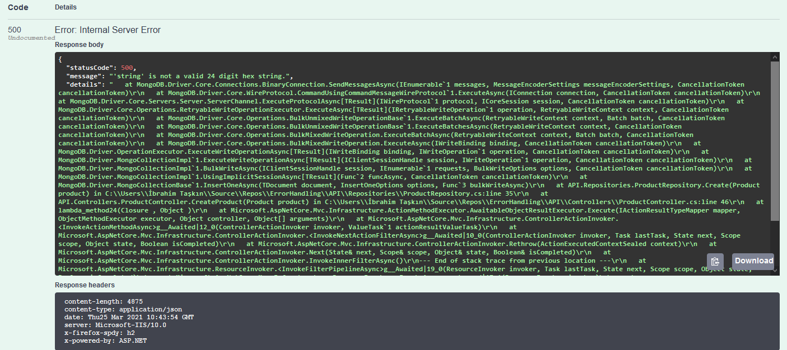
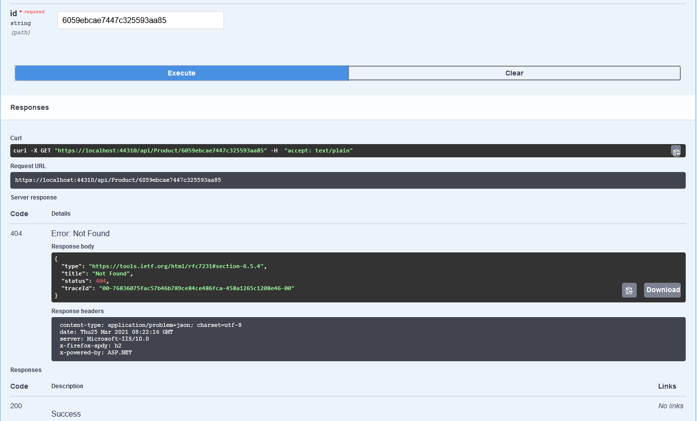

# Custom Error Handling & MongoDb Usage

- ## AspNet Core Own Error Handler

  > We can use `app.UseExceptionHandler()` .Net Core feature.

- ## Custom Error Handler and Middleware

  ```
  public async Task InvokeAsync(HttpContext context)
        {
            try
            {
                await _next(context); // Herhangi bir sorun yoksa diğer Middleware'e geçecek. _next
            }
            catch (Exception ex)
            {
                _logger.LogError($"Something went wrong {ex.Message}");

                context.Response.ContentType = "application/json";
                context.Response.StatusCode = (int)HttpStatusCode.InternalServerError;

                var response = _env.IsDevelopment()
                    ? new ErrorDetails(context.Response.StatusCode, ex.Message, ex.StackTrace?.ToString())
                    : new ErrorDetails(context.Response.StatusCode, "Server Error");

                var options = new JsonSerializerOptions { PropertyNamingPolicy = JsonNamingPolicy.CamelCase };

                var json = JsonSerializer.Serialize(response, options);

                await context.Response.WriteAsync(json);
            }
        }
  ```

  > \_next RequestDelegate is used Core pipeline.

- ## MongoDb Configuration

  - Mongo Client settings configured here. ConnectionString , DatabaseName and CollectionName comes IProductDatabaseSettings, from User Secrets.

  ```
  public class ProductContext : IProductContext
    {
        public ProductContext(IProductDatabaseSettings databaseSettings)
        {
            var client = new MongoClient(databaseSettings.ConnectionString);
            var database = client.GetDatabase(databaseSettings.DatabaseName);
            Products = database.GetCollection<Product>(databaseSettings.CollectionName);

            ProductContextSeed.Seed(Products);
        }

        public IMongoCollection<Product> Products { get; }
    }
  ```

  ## Results

  - Null Product add
    

  - Invalid Product Id Request
    
